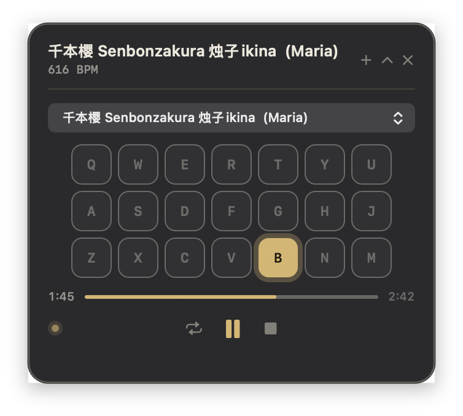

# 原神风物之诗琴自动演奏器

<p align="center">
  <a href="README.md">English</a> | <strong>简体中文</strong>
</p>

一款原生 macOS 悬浮面板（HUD），通过向游戏发送按键，替你演奏《原神》中的风物之诗琴。

**本项目专为 Apple Silicon Mac 上通过 [PlayCover](https://playcover.io/) 运行的原神打造** —— 它借助 PlayCover 的键盘映射驱动游戏，并自动查找 PlayCover 中的「Genshin Impact」窗口。它是一个独立的浮动面板，停靠在该窗口旁边，**不会注入、修改或读取游戏进程**。它无法用于官方手机/PC 客户端、云游戏版本，或任何非 macOS PlayCover 版本的原神。

<p align="center">
  
</p>

<p align="center">
  <em>HUD 会跟随原神窗口移动，演奏时实时点亮对应的琴键，并在原神失去焦点时自动隐藏。</em>
</p>

### 演示

https://github.com/user-attachments/assets/bd77c3c4-1861-40bd-bfb5-8b45bca6b689

如果视频无法直接播放，请下载 <a href="assets/demo.mp4">assets/demo.mp4</a>。

---

> [!WARNING]
> **使用风险自负。自动化游戏操作可能导致账号被封禁。**
> 本工具会向《原神》发送模拟按键，这很可能违反 HoYoverse 的服务条款。
> 本项目仍处于**早期开发阶段**，因此是否会触发封号**尚无定论** —— 无论哪种结果都没有任何保证。
> 一旦使用，即表示你完全接受这一风险。建议使用小号，不要在你不愿失去的账号上使用。

---

## 功能

- **停靠在原神旁边。** 启动时位于游戏窗口右上角，并随窗口移动；你可以把它拖到任意位置，它会记住你的摆放位置。原神不在最前台时自动隐藏。
- **替你演奏。** 可打开一个或多个 `.genshinsheet`、`.mid`、`.midi` 文件（或整个文件夹）作为播放列表。同一文件夹中同名的乐谱与 MIDI 文件会合并为一首歌，可在乐曲选择器中切换来源。支持播放 / 暂停 / 停止、进度拖动、循环和变速。
- **实时显示状态。** 21 键琴盘会实时点亮；进度条和脉动状态点显示播放进度。
- **帮助你学习。** 练习模式会把乐曲拆分为一个个乐句，高亮当前需要弹奏的音符或和弦，只有在你通过键盘或 HUD 弹对后才会前进，不会自动播放。开启**按歌曲速度练习**，即可按照乐曲的时间轴练习，并获得太早、太晚和漏弹的反馈。连续三次无错弹完一个乐句即视为**已掌握**。完整功能见下方[练习模式](#练习模式)。循环功能始终重复当前载入的乐曲。
- **也能手动弹奏。** 点击 HUD 琴盘上的按键，即可亲自向原神发送对应音符。
- **更像真人。** 按键时长和和弦间隔带有随机变化，开始前有 3 秒预备拍，并会自动切换到下一首。
- **精准定位。** 按键只会发送给原神进程（`CGEventPostToPid`）—— 不会向游戏注入任何内容。
- **默认支持后台播放。** 播放时不会把原神切到前台，而 HUD 会跟随原神的焦点，在原神回到前台时重新出现。如需仅在前台播放，可在 HUD 的「播放」设置中关闭**后台播放**。输入始终只发送给目标进程，绝不会退回到全局发送。

## 练习模式

练习模式会把 HUD 变成一位风物之诗琴老师。以下功能都在齿轮菜单的**练习**分组中。

**专项练习**
- **循环练习乐句直到掌握** —— 乐句会原地重复，直到你连续三次无错弹完，然后才进入下一句。
- **点击乐句循环练习** —— 在「练习数据」的乐句图表中点击任意一列，即可直接跳到该乐句并循环练习；再次点击即可取消。
- **练习最薄弱的乐句** —— 根据已保存的历史，从整个播放列表中挑出你最薄弱的五个乐句，逐个练习；需要时会自动切换乐曲，每掌握一句就进入下一句。

**速度**
- **逐步加速** —— 关闭、从当前速度开始，或每次从 50% / 60% / 75% 开始，每干净地完成一个乐句提高 0.05×，直到原速。
- **节奏难度** —— 简单（提前 350 ms / 漏弹 700 ms）、普通（220 / 450 ms）或严格（120 / 250 ms，并且和弦的所有按键必须在 120 ms 内按下）。
- **节拍器** —— *音符提示*：每个计时音符到点时提示；*稳定节拍*：按乐曲的 BPM 打拍（强拍加重，预备拍也会打拍）。

**反馈**
- **连击** —— 连续弹对的音符数；达到 5 次后会显示在 HUD 上。
- **练习总结** —— 每次练习结束（停止或弹完）时，「练习数据」会自动打开，显示评级、准确率、与最佳成绩的差距、最高连击和最薄弱的乐句。可通过**练习结束后显示总结**关闭。
- **练习数据** —— 字母评级（S–D）、与之前最佳成绩对比的准确率、已掌握乐句、音符、错键、反应时间、连击、未完成和弦以及当前乐句的无错连续次数，另外还有：
  - **节奏分布**（准时 / 太早 / 太晚 / 漏弹），以及每个音符偏离节拍多远的直方图，并给出*偏快 / 偏慢 / 节奏稳定*的判断；
  - 最近 30 次练习准确率的**进步曲线**；
  - 按准确率着色的**乐句热力图**，虚线标出本次练习之前的最佳成绩，方便你看到自己超越它。

停止后每次按下播放都会开始一次新的练习；历史记录（最佳成绩、每个乐句的最佳成绩以及练习日志）会按乐曲名称保存在本地，即使从未打开「练习数据」也会保存。

## 后台输入

后台输入取决于你安装的 PlayCover 版本是否会在原神进程处于非活动状态时接收定向键盘事件。如果 PlayCover 只在活动状态下处理映射输入，请使用前台播放；本应用依然绝不会全局发送按键。

## 环境要求

- 搭载 **Apple Silicon** 的 macOS
- [PlayCover](https://playcover.io/) + 原神
- Xcode 命令行工具（`xcode-select --install`）—— 提供 `clang++` 和 macOS SDK，无需安装完整 Xcode。
- [nlohmann/json](https://github.com/nlohmann/json) —— `brew install nlohmann-json`
- 为你用来运行本程序的终端授予**辅助功能权限**（系统设置 → 隐私与安全性 → 辅助功能）

## 快速开始

```bash
brew install nlohmann-json
make build
make run
```

然后在 HUD 中：**打开乐谱…** → 选择 `.genshinsheet` 或 MIDI 文件（可从 [Genshin Music](https://specy.github.io/genshinMusic/) 导出乐谱）→ 点击播放。3 秒预备拍后，按键就会发送给原神。

> 请先导入键位映射并装备风物之诗琴 —— 见下方 [PlayCover 键位映射](#playcover-键位映射)。没有它，模拟按键永远无法传到琴上。

## PlayCover 键位映射

PlayCover 会把键盘按键映射到屏幕上的琴键。本项目附带了适用于标准 21 键布局的 `Genshin Impact.playmap`（应用标识 `com.miHoYo.GenshinImpact`）：

```
Q  W  E  R  T  Y  U
A  S  D  F  G  H  J
Z  X  C  V  B  N  M
```

在 PlayCover 的原神键位映射中导入它，然后在游戏中装备风物之诗琴。

## HUD 操作

| 控件 | 作用 |
| --- | --- |
| 播放 / 暂停 | 开始或暂停（播放前有 3 秒预备拍） |
| 停止 | 停止并回到开头 |
| 循环 | 只重复当前载入的乐曲，不切换播放列表 |
| 上一首 / 下一首 | 在播放列表中切换（载入 2 首及以上时显示） |
| 进度条 | 点击或拖动以跳转 |
| 速度按钮 | 点击在预设速度间切换（0.5× → 2×）；在 HUD 上滚动可微调（0.25×–3×） |
| 点击琴键 | 手动向原神发送该音符 |
| 当前 / 下一个 练习提示 | 无需离开 HUD 即可查看当前应弹的音符，以及可选的下一个音符 |
| 练习模式（练习菜单） | 逐个音符练习当前乐曲；自动播放会被关闭 |
| 按歌曲速度练习（练习菜单） | 以所选速度跟随乐曲节奏，并提供太早 / 太晚 / 漏弹反馈 |
| 逐步加速（练习菜单） | 关闭、从当前速度开始，或每次从 50/60/75% 开始，每干净地完成一个乐句提高 0.05×，最高到 1× |
| 节奏难度（练习菜单） | 为按歌曲速度练习选择简单、普通或严格的判定范围 |
| 循环练习乐句直到掌握（练习菜单） | 每个乐句重复练习，直到连续三次无错 |
| 练习最薄弱的乐句（练习菜单） | 依次练习整个播放列表中最薄弱的五个乐句 |
| 练习结束后显示总结（练习菜单） | 练习结束时打开「练习数据」并显示总结 |
| 练习延迟校准（设置菜单） | 补偿输入 / 显示延迟，范围 −150 ms 到 +150 ms |
| 预备拍（设置菜单） | 选择不使用预备拍，或 1–5 秒 |
| 节拍器（练习菜单） | 关闭、*音符提示*（每个计时音符到点时提示）或按乐曲 BPM 的*稳定节拍* |
| 减少动态效果（设置菜单） | 关闭 HUD 的闪光、脉动和折叠动画 |
| 高对比度（辅助功能菜单） | 加强琴键边框和标签，不改变当前主题 |
| 练习数据（练习菜单） | 评级、与最佳成绩对比的准确率、连击、节奏直方图、进步曲线，以及可点击的乐句热力图 |
| 播放列表菜单 | 调整顺序、收藏、移除、清空、重新打开最近播放，或仅显示收藏 |
| 重新练习乐句（练习菜单 / `⌘↩`） | 回到当前乐句的开头 |
| `+`（标题栏） | 向播放列表添加更多乐曲 |
| 折叠箭头 | 折叠为迷你栏 |
| `×` | 隐藏 HUD 并停止 |
| 拖动 HUD | 移动到任意位置；它默认停靠在右上角，并在游戏窗口移动时保持你的摆放位置 |
| 右键 HUD | 打开分组的「练习」「播放」「辅助功能」设置，其中包括后台播放 |

**全局快捷键**（原神处于焦点时）：`⌘⌥Space` 播放/暂停 · `⌘⌥.` 停止 · `⌘⌥L` 循环 · `⌘⌥H` 唤出 HUD。

## 从终端运行

```bash
make run                                  # 启动 HUD；在界面中打开乐谱
make run SHEET="path/to/song.genshinsheet"  # 启动 HUD 并载入一份乐谱
make run SHEET="path/to/folder"             # 启动 HUD 并载入一个文件夹
make run SHEET="path/to/song.genshinsheet" NO_HUD=1   # 无界面自动演奏
```

也可以直接调用二进制文件：

```bash
./macauto.out
./build/macauto.out song.genshinsheet song.mid folder/
./build/macauto.out --no-hud song.mid
```

路径中含有空格或 `()` 时请加引号。播放列表会在多次启动之间保留；不带参数启动时，HUD 会恢复上一次的播放列表。

### 本地设置

HUD 的状态 —— 播放列表、折叠状态、后台播放及其他播放 / 练习偏好、收藏以及练习数据历史 —— 保存在**二进制文件旁边的 `build/hud-settings.json`** 中，而不是 macOS 偏好设置里。练习历史 —— 最佳准确率、每个乐句的最佳成绩，以及每首乐曲最近 30 次练习的日志 —— 存放在原生的 `practice_history` JSON 对象下。它仅属于当前用户且只保存在本机：不会被分享或提交（该文件已被 git 忽略），因此绝不会把你的乐曲带给其他人。删除该文件即可重置。

## 辅助功能权限（必需 —— 没有它就无法发送按键）

向原神发送按键（`CGEventPostToPid`）受 macOS 对正在运行的进程的**辅助功能**权限限制。请为你用来启动本程序的终端授权，否则第一次播放时会毫无反应：

1. 先运行一次。出现提示时，点击**打开辅助功能设置**（或自行打开 系统设置 → 隐私与安全性 → 辅助功能）。
2. 在列表中启用你的终端（Terminal、iTerm 等）。
3. 重新启动后再试一次。

## 支持的乐谱文件

解析器支持 **[Specy 的 Genshin Music](https://specy.github.io/genshinMusic/)** 的 `.genshinsheet` JSON 文件，以及格式 0 和格式 1 的基于 PPQ 的标准 MIDI 文件（`.mid` / `.midi`）。MIDI 的 note-on 事件会根据文件的时间精度和速度表转换为带时间的和弦。如果存在有效的 MIDI 调号，音符会被整体移调到 C 大调或 A 小调，再按八度平移，以尽可能多地落在琴的音域内。非标准的调号元数据会被忽略，以便其他方面有效的 MIDI 文件仍能载入。琴只能准确演奏 21 个自然音，即 C3–B5（`Z…M`、`A…J`、`Q…U`）；其余的变化音和超出音域的音高会被跳过。起始时间相差不超过 30 毫秒的音符（在人性化处理过的 MIDI 和录制的乐谱中很常见）会合并为一个和弦，因此会被同时演奏，练习时也需要同时弹奏。

## 工作原理

- **PlayerWindow**（`src/PlayerWindow.mm`）—— HUD 本体：一个位于屏保窗口层级的无边框 `NSPanel`，包含自绘的琴盘 / 进度条 / 状态点，以及窗口跟随和焦点逻辑。
- **PlaybackController**（`src/playback_controller.cpp`）—— 按时间表发送音符的工作线程；负责播放 / 暂停 / 停止、跳转、循环、变速和预备拍。
- **parser**（`src/parser.cpp`）—— 将 `.genshinsheet` / MIDI 转换为带时间的 `Note`。
- **keyboard**（`src/keyboard.mm`）—— 以类似真人的随机抖动向原神进程发送 `CGEvent` 按键。
- **genshin**（`src/genshin.mm`）—— 查找原神进程并将其切到前台。
- **settings**（`src/settings.cpp`）—— 读写本地的 `hud-settings.json`。

## 项目状态

**早期开发阶段。** 可能存在粗糙之处、行为变化和 bug。功能和文件格式可能随时变更，恕不另行通知。

## 致谢

- **[PlayCover](https://playcover.io/)** —— 让原神（以及其他 iOS 应用）能在 Apple Silicon macOS 上运行，并提供本项目所依赖的键盘映射。没有它，本项目就无法实现。
- **[Specy 的 Genshin Music](https://specy.github.io/genshinMusic/)**（[源代码](https://github.com/Specy/genshin-music)）—— 乐谱编辑器 / 播放器，以及本工具读取的 `.genshinsheet` 格式。
- **[nlohmann/json](https://github.com/nlohmann/json)** —— JSON 解析。

这是一个粉丝制作的非官方项目，**与 HoYoverse/miHoYo、PlayCover 或 Specy 均无任何关联，也未获得其认可或背书。**「原神」「Genshin Impact」及相关标志归其各自所有者所有。

## 免责声明

本软件按「原样」提供，不附带任何形式的保证。用它自动化游戏操作可能违反 HoYoverse 的服务条款，**并可能导致账号被暂停或封禁** —— 请参阅顶部的警告。使用本软件的一切风险由你自行承担；对于你的账号或系统发生的任何问题，作者概不负责。

## 许可证

MIT —— 见 [`LICENSE`](LICENSE)。
